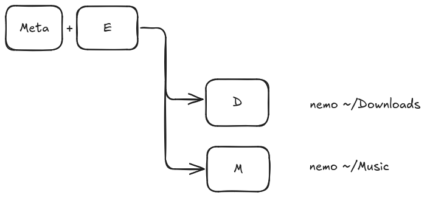
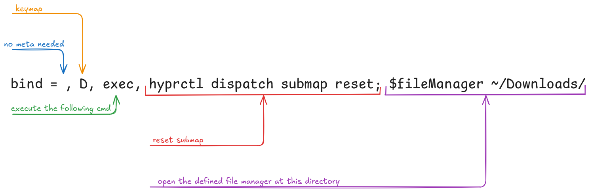

## What are Submaps?

Submaps are a way to define multi-dimensional keybindings. This means that you can define keybindings that depend on a sequence of keys. This is useful if you want to have a lot of keybindings but don't want to run out of keys. Furthermore, submaps can help you to structure your keybindings in a more logical way.

### Example


This little diagram shows how a submap works. In this example, the keybinding `meta` plus `e` followed by `d` is defined to open the file manager at the _Downloads_ directory.

### neovim

Probably the most famous example of a submap is the `neovim` keybinding system. In `neovim` you can define keybindings depending on a sequence of keys. For example, you can define a keybinding for `g` followed by `d` followed by `d` to delete a line. This is called a submap in Hyprland.

## How to define Submaps

First of all, it is recommended to split the Hyprland configuration into multiple files. This makes it easier to manage the configuration and to keep it clean. This can be done by importing the files in the main configuration file (`~/.config/hypr/hyprland.conf`).

```
source = ~/.config/hypr/modules/keybindings.conf
```

As you can see in my [dotfiles](github.com/bitSheriff/dotfiles) I have a specific files where I define my applications as well. This is a goof idea if you switch the applications often, because you don't have to edit multiple lines and files.

```
$fileManager = nemo
```

And late it can be used with `$fileManager` in the keybindings-file and any other file.

So in the following example we will just edit the `keybindings.conf` file.

```conf
bind=$mainMod, E ,submap,files

submap=files

    # shortcuts for impotant folders
    bind = , D, exec, hyprctl dispatch submap reset; $fileManager ~/Downloads/
    bind = , M, exec, hyprctl dispatch submap reset; $fileManager ~/Music/
    bind = , V, exec, hyprctl dispatch submap reset; $fileManager ~/Videos/
    bind = , P, exec, hyprctl dispatch submap reset; $fileManager ~/Pictures/
    bind = , W, exec, hyprctl dispatch submap reset; $fileManager ~/Documents/
    bind = , C, exec, hyprctl dispatch submap reset; $fileManager ~/code/

    bind= , escape , submap, reset

submap=reset

```

The line `bind=$mainMod, E ,submap,files` defines the keybind to enter a submap. The submap is specified with a name, in this case `files`.
`submap=files` and `submap=reset` define the body of the submap. Everything inside this block is only defined when the submap is active.
The last command line `bind= , escape , submap, reset` is used to leave the submap.



### Addition: Waybar Integration


If you have many different submaps and you muscle memory is not trained yet, sometimes it is hard to get in which _context_ you are. To solve this problem I added a little widget to my Waybar.this widgets shows the current active submap.

```json
  // Hyprland Submaps
  "hyprland/submap": {
    "format": "{}",
    "max-length": 30,
    "tooltip": false,
    "on-click" : "hyprctl dispatch submap reset"
  },

```

Further it can reset (exiting) the submap with a click on the widget.

## Use Cases

As previously mentioned, submaps are a great way to structure your keybindings. You can define a submap for each application or for each category of keybindings. This makes it easier to find the keybindings you are looking for and to remember them.

For example I use them for my file manager, for my browser (different browsers, private window...) and for my code editor, if I use different ones for different projects.

The ideas and possibilities are endless as so often in the ricing world.

## Links & References



- [Hyprland](https://hyprland.org/)
  - [Hyprland Submaps](https://wiki.hyprland.org/Configuring/Binds/#submapshttps://hyprland.org/docs/submaps)
- [Wayland](https://wayland.freedesktop.org/)
- [Waybar](https://github.com/Alexays/Waybar)
- [neovim](https://neovim.io/)

<script src="https://utteranc.es/client.js"
        repo=" bitSheriff/bitSheriff.github.io "
        issue-term="pathname"
        theme="github-dark"
        crossorigin="anonymous"
        async>
</script>
